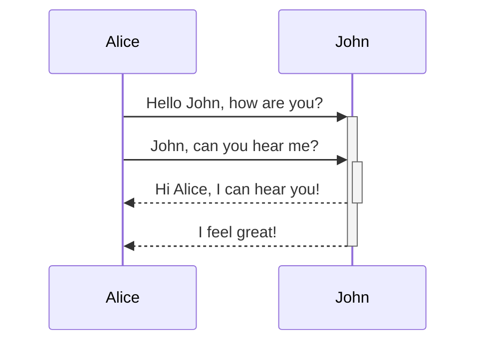

We can add [[mermaid diagram|mermaid diagrams]] in Obsidian by a adding `mermaid` codeblocks.

For example,

````md

````

gives


## Reference
[Advanced formatting syntax - Obsidian Help](https://help.obsidian.md/Editing+and+formatting/Advanced+formatting+syntax#Diagram)